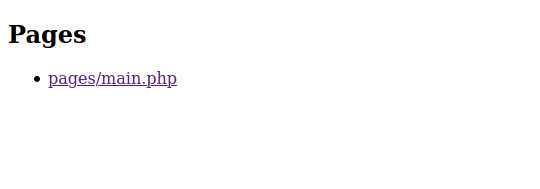

# Capítulo 1. Creando un proyecto.

En el presente capítulo abordaremos de forma práctica la manera de crear un proyecto ComposedViews basado de la popular plantilla de administración [AdminLTE](https://adminlte.io/). Hemos decidido escoger dicha plantilla dado que entre otras bondades la misma ofrece una [página básica](https://adminlte.io/themes/AdminLTE/starter.html) la cual nos servirá para mostrar de forma clara los conceptos que se deben tener en cuenta sobre ComposedViews.

Una vez finalizado dicho capítulo habremos construido un proyecto PHP instalable por [Composer][Composer] el cual contendrá clases cuyas instancias serán capaces de generar el código HTML de la página así como de sus componentes. Además de ello, el proyecto contendrá los recursos de la maqueta los cuales estarán correctamente referenciados desde el HTML generado y además podrán ser instalados en cualquier aplicación PHP con solo ejecutar un comando.

>En [este enlace](https://github.com/thenlabs/demo-composed-adminlte) se puede encontrar el proyecto realizado en el capítulo.

## Consideraciones sobre los proyectos.

Un proyecto ComposedViews es un paquete [Composer][Composer] de tipo `then-package`. A los paquetes de este tipo los definimos como *then packages* y se gestionan además con la herramienta [ThenLabs CLI](http://thenlabs.org/docs/cli/master/es/index.html).

Es importante que lea la documentación de esta herramienta dado que en la misma se define más profundamente lo que es un *then package* entre otros conceptos adicionales que necesitará conocer para la comprensión de esta guía.

## Creando el nuevo proyecto.

### Linux y Mac.

Ejecute el siguiente comando:

    $ composer create-project thenlabs/kit-template composed-admin-lte dev-master

>Puede sustituir `composed-admin-lte` por el nombre del directorio donde desea crear su proyecto.

En determinado momento [Composer][Composer] le preguntará si desea eliminar el repositorio actual. Recomendamos que inique sí ya que no tiene ningún sentido que su proyecto contenga esos *commits*. Este paso será automatizado en futuras versiones.

Se le preguntará además sobre ciertos datos del proyecto donde podrá especificar los valores que desee **excepto en el tipo y las dependencias donde deberá mantener los valores por defecto**.

>En nuestro caso especificaremos `thenlabs/demo-composed-adminlte` como nombre del proyecto.

### Windows.

En el caso de los usuarios Windows deberán [seguir estos pasos](win.md).

## Conociendo la estructura del proyecto.

Una vez que se ha creado el proyecto podremos encontrar la siguiente estructura de archivos dentro del directorio del mismo.

```
├── assets/
├── composer.json
├── composer.lock
├── examples/
│   ├── index.php
│   ├── pages/
│   │   └── main.php
│   └── then.json
├── README.md
├── serve
├── src/
├── tests/
└── then-package.json
```

Como se puede suponer, en el directorio `assets` se deberán almacenar todos los recursos web de las vistas a los que popularmente se les conoce como *assets*.

Dado que las vistas son elementos apreciables visualmente, se hace necesario que estos proyectos contengan páginas de ejemplos con el objetivo de que cuenten con algún mecanismo de visualización.

Teniendo en cuenta además, que a medida que se van llevando a cabo los desarrollos de las vistas se necesita ir visualizando sus resultados, existe una funcionalidad que permite servir en una URL local todas las páginas de ejemplos del proyecto. Para iniciar esta funcionalidad se debe ejecutar el siguiente comando:

    $ php serve

De esta manera se habrá iniciado la siguiente aplicación web en la dirección http://localhost:8080.



>Si por algún motivo necesita ejecutar la aplicación en otra dirección puede especificar `<dirección>:<puerto>` al final del comando.

Como puede verse, la aplicación muestra un listado con las páginas de ejemplos del proyecto donde por defecto solo existe creada una que al abrirla mostrará el popular mensaje **Hello World**.

En el directorio `examples` puede encontrarse esta aplicación la que puede ser editada si así lo desea, no obstante queremos aclarar que su única finalidad es la de listar las páginas de ejemplos que existan en el proyecto.

Por otra parte, En el directorio `examples/pages` se encontrará el archivo `main.php` donde se encuentra creada la vista que muestra el saludo anterior. Este archivo puede ser editado o eliminado si lo desea, pero será en este directorio donde se deberán alojar todas las páginas de ejemplos del proyecto.

## Definiendo el espacio de nombres para las clases del proyecto.

Como se comentó anteriormente las vistas se crean con clases PHP. Es recomendable que las mismas se creen bajo determinados espacios de nombres y dado que en el proyecto recién creado no existe ninguno, lo primero que haremos será definir uno nuevo.

Para ello agregue al archivo `composer.json` los siguientes datos:

```json
{
    "autoload": {
        "psr-4": {
            "ThenLabs\\Demo\\ComposedAdminLte\\": "src/"
        }
    }
}
```

Seguidamente ejecute el comando:

    $ composer dump

## Definiendo los assets del proyecto e instalándolos para los ejemplos.

Cuando analizamos la [estructura del proyecto AdminLTE](https://github.com/ColorlibHQ/AdminLTE/tree/v2) vemos que existen los archivos [package.json][adminlte-package.json] y [bower.json][adminlte-bower.json]. Esto significa que este proyecto depende de *assets* que se tienen que instalar con [NPM][NPM] y [Bower][Bower]. Además de esto conocemos que en el directorio [dist][adminlte-dist] existen otros que son propios de dicho proyecto.

Para lograr que nuestro *then package* contenga todos esos recursos, vamos a copiar dentro del directorio `assets`, los archivos [package.json][adminlte-package.json], [bower.json][adminlte-bower.json] y el contenido del directorio [dist][adminlte-dist]. Nuestro directorio `assets` nos debe quedar de la siguiente manera:

```
├── assets/
│   ├── css/
│   ├── js/
│   ├── img/
│   └── package.json
│   └── bower.json
```

Para lograr que los archivos `package.json` y `bower.json` sean correctamente tratados, debemos especificar que los mismos deberán ser combinados con otros de igual nombre que pueden pertenecer tanto a otros *then packages* como a la propia aplicación PHP donde esté instalado el *then package* que estamos desarrollando. Para ello, vamos a editar el archivo `then-package.json` de la siguiente manera:

```json
{
    "assets": {
        "assets/*": ""
    },
    "mergeJson": {
        "assets/bower.json": {
            "target": "bower.json",
            "keys": ["dependencies", "devDependencies", "name"]
        },
        "assets/package.json": {
            "target": "package.json",
            "keys": ["dependencies", "devDependencies"]
        }
    }
}
```

Para lograr que los ejemplos tengan disponibles los recursos que acabamos de copiar en el directorio `assets`, debemos ejecutar la herramienta `php serve`. Es importante mencionar que si la misma ya se encontraba iniciada será necesario reiniciarla para que se incluyan las actualizaciones. En futuras versiones esto será corregido.

Una vez que hayamos realizado el paso anterior debemos descargar para los ejemplos las dependencias de los archivos `bower.json` y `package.json`. Para ello ejecutamos lo siguiente:

    $ cd examples/assets
    $ npm install
    $ bower install

## Creando la vista de la página.

Para crear vistas existen dos clases fundamentales, ellas son `ThenLabs\ComposedViews\AbstractView` y `ThenLabs\ComposedViews\AbstractCompositeView`. La única diferencia entre ambas es que la segunda está pensada para vistas que puedan contener otras vistas.

>Estas clases están implementadas con el proyecto [Components](https://github.com/thenlabs/components/) por lo que se recomienda leer la documentación del mismo para entender algunos de sus métodos así como otros conceptos en general.

Las clases de las vistas como requisito mínimo deberán definir el método `getView(): string` el cual deberá devolver en una cadena de texto el contenido de la vista.

Para el caso de la página crearemos el archivo `src/Layout.php` con el siguiente contenido:

```php
<?php
// src/Layout.php

namespace ThenLabs\Demo\ComposedAdminLte;

use ThenLabs\ComposedViews\AbstractView;

class Layout extends AbstractView
{
    public function getView(): string
    {
        return <<<HTML
...
HTML;
    }
}
```

>La cadena *heredoc* anterior debe contener el contenido del archivo [starter.html](https://github.com/ColorlibHQ/AdminLTE/blob/v2/starter.html). Por razones de espacio en el ejemplo lo representamos solo con tres puntos.

Seguidamente editaremos el archivo `examples/pages/main.php` de la siguiente manera:

```php
<?php
// examples/pages/main.php

use ThenLabs\Demo\ComposedAdminLte\Layout;

$page = new Layout;

echo $page->render();
```

Una vez realizado lo anterior, si visitamos la página de ejemplo comprobaremos que se mostrará el contenido especificado pero existirán errores en las referencias de los *assets*. La siguiente imagen muestra esta situación:


En los casos de las vistas que dependen de determinados *assets* deberán implementar en sus clases el método `getOwnDependencies(): array` el cual deberá devolver un *array* con las instancias de dichas dependencias. Cuando analizamos el HTML de la página vemos que depende de [estas hojas de estilo](https://github.com/ColorlibHQ/AdminLTE/blob/v2/starter.html#L13-L23) y de [estos scripts](https://github.com/ColorlibHQ/AdminLTE/blob/v2/starter.html#L399-L403), por lo que hacemos la siguiente implementación:

```php
<?php

namespace ThenLabs\Demo\ComposedAdminLte;

// ...
use ThenLabs\ComposedViews\Asset\Stylesheet;
use ThenLabs\ComposedViews\Asset\Script;

class Layout extends AbstractView
{
    public function getOwnDependencies(): array
    {
        return [
            // styles
            new Stylesheet('bootstrap-css', null, 'bower_components/bootstrap/dist/css/bootstrap.min.css'),
            new Stylesheet('fontAwesome-css', null, 'bower_components/font-awesome/css/font-awesome.min.css'),
            new Stylesheet('ionicons-css', null, 'bower_components/Ionicons/css/ionicons.min.css'),
            new Stylesheet('adminlte-css', null, 'thenlabs/demo-composed-adminlte/css/AdminLTE.min.css'),
            new Stylesheet('adminlte-skin-css', null, 'thenlabs/demo-composed-adminlte/css/skins/skin-blue.min.css'),

            // scripts
            new Script('jquery', null, 'bower_components/jquery/dist/jquery.min.js'),
            new Script('bootstrap-js', null, 'bower_components/bootstrap/dist/js/bootstrap.min.js'),
            new Script('adminlte-js', null, 'thenlabs/demo-composed-adminlte/js/adminlte.min.js'),
        ];
    }

    // ...
}
```

Como puede ver las dependencias de *assets* se definen con instancias de clases del espacio de nombres `ThenLabs\ComposedViews\Asset`. A estas clases se les deberá especificar como su primer argumento el nombre del recurso, como segundo un valor opcional en formato [semver](https://semver.org/) y como tercero la [URI][URI] del recurso.

Los nombres de los recursos deben ser valores que representen en la mayor medida posible al recurso. Es recomendable que contengan solo caracteres en minúsculas y que se usen un guiones en vez de espacios. Se recomienda además que se usen sufijos con el tipo del recurso como por ejemplo `bootstrap-css` y `bootstrap-js`.

Respecto a las [URIs][URI] de los recursos deben ser valores relativos ya que recordemos que esos *assets* serán copiados dentro del directorio público de la aplicación donde se encuentre instalado el *then package* que estamos desarrollando. Como puede ver, en el caso de los *assets* que son descargados con [Bower][Bower], su [URI][URI] debe comenzar por `bower_components` dado que el mismo crea ese directorio para sus descargas. De igual manera ocurre con [NPM][NPM] donde en ese caso su directorio es `node_modues`, pero en el caso de los que son propios del proyecto, serán copiados dentro de un directorio que se creará teniendo en cuenta el valor `name` del archivo `composer.json` del *then package*. Recordemos que el nombre que le dimos al mismo fue `thenlabs/demo-composed-adminlte`.

Seguidamente debemos editar la vista para hacer que los *assets* se muestren correctamente. Para el caso de los estilos reemplazamos [estas líneas](https://github.com/ColorlibHQ/AdminLTE/blob/v2/starter.html#L13-L23) por `{$this->renderStyles()}` y de igual forma lo hacemos con los *scripts* modificando [estas otras](https://github.com/ColorlibHQ/AdminLTE/blob/v2/starter.html#L399-L403) por `{$this->renderScripts()}` tal y como se muestra en el siguiente ejemplo:

```php
<?php

namespace ThenLabs\Demo\ComposedAdminLte;

class Layout extends AbstractView
{
    // ...

    public function getView(): string
    {
        return <<<HTML
<!DOCTYPE html>
<!--
This is a starter template page. Use this page to start your new project from
scratch. This page gets rid of all links and provides the needed markup only.
-->
<html>
<head>
  <meta charset="utf-8">
  <meta http-equiv="X-UA-Compatible" content="IE=edge">
  <title>AdminLTE 2 | Starter</title>
  <!-- Tell the browser to be responsive to screen width -->
  <meta content="width=device-width, initial-scale=1, maximum-scale=1, user-scalable=no" name="viewport">

  {$this->renderStyles()}

  ...
</head>

...

<!-- REQUIRED JS SCRIPTS -->

{$this->renderScripts()}

<!-- Optionally, you can add Slimscroll and FastClick plugins.
     Both of these plugins are recommended to enhance the
     user experience. -->
</body>
</html>
HTML;
    }
}
```

Después de haberse realizado los pasos anteriores ya el *then package* podría ser utilizado dentro de una aplicación PHP y la vista `Layout` se mostraría con los *assets* que antes especificamos. El único detalle que faltaría sería especificarle a la vista la ruta base del directorio público donde se encontrarán instalados los archivos de los *assets*. Esto último se hace llamando al método `setBasePath(string $basePath): void` sobre la vista. Dado que también en las páginas de ejemplos debemos especificar este valor modificamos el archivo `examples/pages/main.php` de la siguiente manera:

```php
<?php

use ThenLabs\Demo\ComposedAdminLte\Layout;

$page = new Layout;
$page->setBasePath('/assets/');

echo $page->render();
```

>En las páginas de ejemplo siempre se debe especificar el valor `/assets/` como ruta base, a menos que por alguna razón se modifique el contenido del directorio `examples`.

Una vez que hayamos realizado todos los pasos anteriores podremos nuevamente recargar la página de ejemplos y comprobar que la misma ahora se muestra con sus *scripts* y estilos cargados correctamente:


>Usted puede notar que las imágenes no se muestran correctamente, y es que anteriormente solo ajustamos las hojas de estilo y los *scripts*. Dado que estamos desarrollando un proyecto de demostración y ya explicamos la manera en que se deben referenciar los *assets* no nos vamos a centrar en ese detalle, no obstante, queremos comentarle que las vistas cuentan con el método `getBasePath(): string` el cual devolverá el valor de la ruta base que se le haya especificado a la vista. Usted puede emplear este método para corregir manualmente ciertas referencias.

## Dinamizando datos en las vistas.

Hasta este momento hemos sido capaces de crear la vista de la página con los *assets* referenciados correctamente, sin embargo el resto del HTML es estático y dado que estamos desarrollando un proyecto pensado para que sea usado en otras aplicaciones, necesitaremos dinamizar ciertas partes para que el mismo se pueda generar lo más personalizado posible.

Para la dinamización de ciertos datos de la vista, es posible declarar propiedades y especificarles la anotación `ThenLabs\ComposedViews\Annotation\Data`. En nuestro ejemplo, vamos a dinamizar el título de la página, y el título del contenido y su descripción. Para ello definimos las tres propiedades siguientes a la clase:

```php
<?php

// ...
use ThenLabs\ComposedViews\Annotation\Data;

class Layout extends AbstractView
{
    /**
     * @Data
     */
    protected $title;

    /**
     * @Data
     */
    protected $contentTitle;

    /**
     * @Data
     */
    protected $contentDescription;

    // ...
}
```

De manera automática las propiedades que poseen esta anotación contarán con métodos dinámicos para las operaciones *getters* y *setters*. Por defecto los nombres de estos métodos comienzan por `get` o `set` según sea el caso y continúan con el nombre de la propiedad en formato *camelCase*. Por ejemplo, en el caso de la propiedad `title` los métodos serían `getTitle()` y `setTitle()`.

>Si por algún motivo se desea modificar los nombres de estos métodos se debe especificar la anotación de la manera `@Data(getter="getMyTitle", setter="setMyTitle")`.

Como hemos visto hasta ahora, es con el método `render(): string` con el que se obtiene el contenido de la vista, sin embargo, el que implementamos para ello es `getView(): string`. De este último podemos decir que recibe un primer argumento `array $data = []` el cual contendrá los valores de las propiedades que posean la anotación antes comentada. Aunque no lo hemos mencionado hasta ahora, al método `render(): string` es posible llamarlo especificándole también un *array* de datos. El objetivo de esto, es que ciertas vistas pueden depender de datos que solo se especificarán al momento de generar su contenido. Una vez aclarado esto usted debe tener en cuenta que los datos que se pasen de esta manera tendrán prioridades sobre los de las propiedades en caso de que existan coincidencias.

Seguidamente pasamos a hacer las modificaciones al código de la vista de la siguiente manera:

```php
<?php

// ...

class Layout extends AbstractView
{
    // ...

    public function getView(): string
    {
        return <<<HTML
  <head>
  ...
    <title>{$this->title}</title>
  ...
  </head>
  <body>
  ...
    <!-- Content Header (Page header) -->
    <section class="content-header">
      <h1>
        {$this->contentTitle}
        <small>{$this->contentDescription}</small>
      </h1>
      ...
    </section>
  ...
  </body>
HTML;
    }
}
```

Una vez hecho lo anterior, en nuestra página de ejemplos vamos especificarle valores a esas propiedades:

```php
<?php

use ThenLabs\Demo\ComposedAdminLte\Layout;

$page = new Layout;
$page->setBasePath('/assets/');
$page->setTitle('My Title');
$page->setContentTitle('My Content Title');
$page->setContentDescription('My Content Description');

echo $page->render();
```

De esta manera una vez que recarguemos la página podremos ver que la misma mostrará los valores esperados:


Con la anotación `@Data` es posible declararle los valores que podría tener la propiedad. De esta forma, si a la misma se le intenta asignar un valor no declarado a través de su método *setter* se produciría una excepción del tipo `ThenLabs\ComposedViews\Exception\InvalidPropertyValueException`. Si examinamos nuevamente el código HTML de la página podemos ver que sobre el `body` se muestra [esta información](https://github.com/ColorlibHQ/AdminLTE/blob/v2/starter.html#L36-L56) sobre las clases que podría tener este elemento. Conociendo esto vamos a declararle nuevos datos a nuestra vista para dinamizar estas opciones:

```php
<?php

class Layout extends AbstractView
{
    // ...

    /**
     * @Data(values={"blue", "black", "purple", "yellow", "red", "green"})
     */
    protected $skin = 'blue';

    /**
     * @Data(values={"fixed", "layout-boxed", "layout-top-nav", "sidebar-collapse", "sidebar-mini"})
     */
    protected $layoutType = 'sidebar-mini';

    public function getView(): string
    {
        return <<<HTML
  ...
  <body class="hold-transition skin-{$data['skin']} {$data['layoutType']}">
  ...
HTML;
    }
}
```

Después de que realizamos lo anterior podríamos comprobar que estos valores han quedado dinamizados correctamente. Sin embargo, notamos que al cambiar de *skin* la página no muestra el color que debería. El motivo se debe a que para que esto ocurra se debe usar la correspondiente hoja de estilos, y cuando definimos las dependencias especificamos que siempre se mostrara la del color azul. Para conseguir lo deseado hacemos la siguiente modificación:

```php
<?php

class Layout extends AbstractView
{
    // ...

    public function getOwnDependencies(): array
    {
        return [
            // ...
            new Stylesheet('adminlte-skin-css', null, "thenlabs/demo-composed-adminlte/css/skins/skin-{$this->skin}.min.css"),

            // ...
        ];
    }
}
```

De esta forma, si en la página de ejemplos especificáramos lo siguiente:

```php
<?php

// ...
$page->setSkin('green');
$page->setLayoutType('layout-boxed');

echo $page->render();
```

Este sería el resultado:


[Composer]: https://getcomposer.org/
[Bower]: https://bower.io/
[NPM]: https://www.npmjs.com/
[adminlte-package.json]: https://github.com/ColorlibHQ/AdminLTE/blob/v2/package.json
[adminlte-bower.json]: https://github.com/ColorlibHQ/AdminLTE/blob/v2/bower.json
[adminlte-dist]: https://github.com/ColorlibHQ/AdminLTE/tree/v2/dist
[URI]: https://es.wikipedia.org/wiki/Identificador_de_recursos_uniforme
