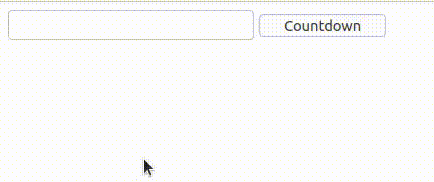

# Ejemplo 3.

## Introducción.

Con este ejemplo lo que se pretende mostrar es que StratusPHP envía mensajes al navegador por *streaming*, es decir, las actualizaciones de la vista se producen instantáneamente y no al final de la solicitud asíncrona.

Puede verse que en el ciclo se produce una demora de 1 segundo y es en ese mismo intervalo cuando la etiqueta va actualizando su valor.

## Implementación.

```php
<?php

use ThenLabs\StratusPHP\Plugin\SElements\AbstractApp;

class App extends AbstractApp
{
    public function getView(): string
    {
        return <<<HTML
            <!DOCTYPE html>
            <html lang="en">
            <head>
                <meta charset="UTF-8">
                <meta name="viewport" content="width=device-width, initial-scale=1.0">
                <title>Document</title>
            </head>
            <body>
                <input s-element="input" type="text">
                <label s-element="label"></label>
                <button s-element="button">Countdown</button>
            </body>
            </html>
        HTML;
    }

    public function onClickButton(): void
    {
        $start = (int) $this->myInput->value;

        for ($i = $start; $i > 0; $i--) {
            $this->myLabel->textContent = $i;
            sleep(1);
        }

        $this->myLabel->textContent = 'End';
    }
}
```

## Resultado.

