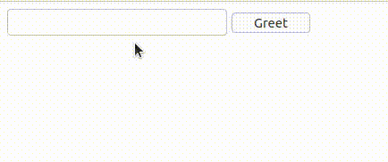

# Ejemplo 1.

## Introducción.

Con este ejemplo se pretender mostrar que los elementos HTML que posean el atributo `s-element` podrán ser manipulados en tiempo real desde la clase PHP de la página. Dichos elementos podrán ser referenciados en la clase con el nombre que se haya asignado como valor a dicho atributo.

Además de esto queremos destacar que las funciones de la clase cuyo nombre sean del tipo `on<nombre_de_evento><nombre_de_componente>` automáticamente serán asignadas como manejadoras del respectivo evento del componente. En el ejemplo puede verse que la función `onClickMyButton` manejará el evento `click` del componente `myButton`.

## Implementación.

```php
<?php
// src/MyPage.php

use ThenLabs\StratusPHP\Plugin\SElements\AbstractPage;

class MyPage extends AbstractPage
{
    public function getView(): string
    {
        return <<<HTML
            <!DOCTYPE html>
            <html lang="en">
            <head>
                <meta charset="UTF-8">
                <meta name="viewport" content="width=device-width, initial-scale=1.0">
                <title>Document</title>
            </head>
            <body>
                <input s-element="myInput" type="text">
                <label s-element="myLabel"></label>
                <button s-element="myButton">Greet</button>
            </body>
            </html>
        HTML;
    }

    public function onClickMyButton(): void
    {
        $this->myLabel->textContent = 'Hello ' . $this->myInput->value;
    }
}
```

## Resultado.



<a class="float-right" href="../2/example.html">Siguiente</a>