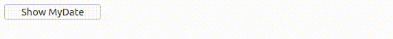

# Ejemplo 10.

## Introducción.

Con este ejemplo se pretende mostrar la capacidad de StratusPHP de realizar llamadas al navegador en cualquier momento ya sea para obtener valores o solamente para realizar algo en el mismo.

Puede verse que cuando la página es cargada en el navegador, automáticamente se crea un objeto de tipo `Date` en el objeto global `window`. Cuando ese botón es presionado, desde el servidor se hará una llamada al navegador para obtener dicho valor para posteriormente mostrarlo de manera formateada.

>Entendemos que esta característica puede crear algunas dudas respecto a su funcionamiento interno. El funcionamiento de StratusPHP será explicado totalmente en un capítulo de la documentación.

## Implementación.

```php
<?php
// src/App.php

use ThenLabs\StratusPHP\FrontCall;
use ThenLabs\StratusPHP\Plugin\PageDom\Element;
use ThenLabs\StratusPHP\Plugin\SElements\AbstractApp;
use ThenLabs\StratusPHP\Annotation\EventListener;

class App extends AbstractApp
{
    public function getView(): string
    {
        return <<<HTML
            <!DOCTYPE html>
            <html lang="en">
            <head>
                <meta charset="UTF-8">
                <meta name="viewport" content="width=device-width, initial-scale=1.0">
                <title>Document</title>
            </head>
            <body>
                <button s-element="myButton">Show MyDate</button>

                <script>
                    window.myDate = new Date();
                </script>
            </body>
            </html>
        HTML;
    }

    public function onClickMyButton(): void
    {
        $time = $this->executeFrontCall(new FrontCall(
            "return window.myDate.getTime();",
            true // indicate that script should returns a value.
        ));

        $dt = new \DateTime;
        $dt->setTimestamp($time / 1000);

        $label = Element::createFromString(
            "<label>{$dt->format('Y-m-d H:i:s')}</label>"
        );

        $this->querySelector('body')->prepend($label);
    }
}
```

## Resultado.

