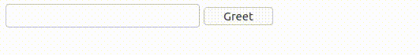

# Ejemplo 2.

## Introducción.

Este ejemplo es muy similar al anterior y lo que se pretende mostrar es que sobre los elementos que ya cuentan con el atributo `s-element`, es posible declarar eventos empleando el atributo de nombre `s-element-event-<nombre_evento>`.

En este caso se ha declarado que el evento clic del botón será manejado por la función `clickOnTheButton`.

## Implementación.

```php
<?php
// src/MyPage.php

use ThenLabs\StratusPHP\Plugin\SElements\AbstractPage;

class MyPage extends AbstractPage
{
    public function getView(): string
    {
        return <<<HTML
            <!DOCTYPE html>
            <html lang="en">
            <head>
                <meta charset="UTF-8">
                <meta name="viewport" content="width=device-width, initial-scale=1.0">
                <title>Document</title>
            </head>
            <body>
                <input s-element="myInput" type="text">
                <label s-element="myLabel"></label>
                <button s-element="myButton" s-element-event-click="clickOnTheButton">Greet</button>
            </body>
            </html>
        HTML;
    }

    public function clickOnTheButton(): void
    {
        $this->myLabel->textContent = 'Hello ' . $this->myInput->value;
    }
}
```

## Resultado.



<a class="float-left" href="../1/example.html">Anterior</a>
<a class="float-right" href="../3/example.html">Siguiente</a>