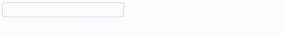

# Ejemplo 7.

## Introducción.

Con este ejemplo lo que se pretende mostrar es que con el atributo `frontListener` de la anotación `ThenLabs\StratusPHP\Annotation\EventListener` es posible especificar un escuchador de evento en el navegador e incluso cancelar la ejecución del escuchador del servidor.

También es importante destacar que desde el código JavaScript es posible referirse a los elementos marcados con el atributo `s-element`. Además de esto, también se puede acceder a los datos del eventos que serán llevados al servidor e incluso modificarlos, y por último, hemos querido mostrar que es posible cancelar la ejecución del escuchador del servidor cuando se necesite.

En el ejemplo, solo se ejecuta el escuchador del navegador cuando se introduce en la caja de texto una letra minúscula.

## Implementación.

```php
<?php
// src/MyPage.php

use ThenLabs\StratusPHP\Plugin\SElements\AbstractPage;
use ThenLabs\StratusPHP\Annotation\EventListener;

class MyPage extends AbstractPage
{
    public function getView(): string
    {
        return <<<HTML
            <!DOCTYPE html>
            <html lang="en">
            <head>
                <meta charset="UTF-8">
                <meta name="viewport" content="width=device-width, initial-scale=1.0">
                <title>Document</title>
            </head>
            <body>
                <input s-element="myInput" type="text">
                <label s-element="myLabel"></label>
            </body>
            </html>
        HTML;
    }

    /**
     * @EventListener(
     *     fetchData={"key", "keyCode"},
     *     frontListener="
     *         if (! (eventData.keyCode >= 97 && eventData.keyCode <= 122)) {
     *             myLabel.textContent = 'Only lower letters they are accepted.';
     *             event.backListener = false;
     *         }
     *     "
     * )
     */
    public function onKeypressMyInput($event): void
    {
        $eventData = $event->getEventData();

        $this->myLabel->textContent = "key: {$eventData['key']}, keyCode: {$eventData['keyCode']}";
    }
}
```

## Resultado.



<a class="float-left" href="../6/example.md">Anterior</a>
<a class="float-right" href="../8/example.md">Siguiente</a>
