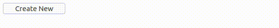

# Ejemplo 9.

## Introducción.

Con este ejemplo se quiere mostrar que con la función `querySelector()` es posible obtener elementos que no posean el atributo `s-element`. Además de esto, se muestra la manera de añadir nuevos elementos de forma dinámica.

## Implementación.

```php
<?php
// src/MyPage.php

use ThenLabs\StratusPHP\Plugin\PageDom\Element;
use ThenLabs\StratusPHP\Plugin\SElements\AbstractPage;

class MyPage extends AbstractPage
{
    protected $counter = 0;

    public function getView(): string
    {
        return <<<HTML
            <!DOCTYPE html>
            <html lang="en">
            <head>
                <meta charset="UTF-8">
                <meta name="viewport" content="width=device-width, initial-scale=1.0">
                <title>Document</title>
            </head>
            <body>
                <button s-element="myButton">Create New</button>
            </body>
            </html>
        HTML;
    }

    public function onClickMyButton($event): void
    {
        $this->counter++;

        $newButton = Element::createFromString("<button>New Button {$this->counter}</button>");

        $this->querySelector('body')->append($newButton);
    }
}
```

## Resultado.



<a class="float-left" href="../8/example.html">Anterior</a>
<a class="float-right" href="../10/example.html">Siguiente</a>